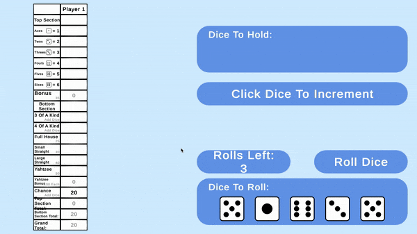
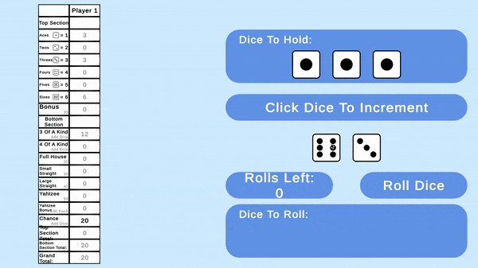

# Yahtzee

A playable Yahtzee game with an advanced AI algorithm.

## Description
In this game the user plays Yahtzee according to the official Hasbro ruleset. The player can roll the dice up to 3 times and decide which category to select with their calculated point value shown for each option. Once the selection has been made the points are saved, the round resets, and the play continues. The total score is automatically calculated throughout the game, and the final score is shown when all categories have been filled out. There is also a component of the game in which the player can use an AI to make decisions that optimize the player score described in the <b>AI Overview</b> section.

## AI Overview
The AI in this project has been constructed using a complex game state graph in conjunction with the dice roll statistical probabilties which results in the perfect strategy to maximize the player score in Yahtzee. [This paper](http://gunpowder.cs.loyola.edu/~jglenn/research/optimal_yahtzee.pdf) contributed to my understanding in designing the algorithm. During the computation of the game state graph, which took my computer weeks to calculate, a bug in the code revealed itself which rendered the entire calculation useless. Due to this outcome this project has been put off, but in the future I may attmept to fix the bug and reconstruct the algorithm to more efficiently produce the calculations in a shorter timespan than weeks.

